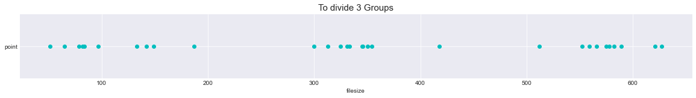

# Der Effekt der Anime-Konvertierung auf das Bild nach dem Hinzufügen von weißem Rauschen
## Xiaojie Sun, You Zou, Yian Yu
### Seminar: Visuelle Wahrnehmung beim Menschen und Bildqualität - WiSe 2020/21
### Geleitet von Prof. Dr. Marianne Maertens und Dr. Guillermo Aguilar

## 1. Einleitung

AnimeGan, das 2021 veröffentlicht wurde, ist eine neue Möglichkeit, Fotos von echten Szenen in Anime-Stil umzuwandeln. Es erfüllt eine sinnvolle und herausfordernde Aufgabe in den Bereichen Computer Vision und künstlerischer Stiltransfer. Durch die Beobachtung der Anime-Konvertierung, merken wir, dass die Anime Bildern weniger für menschliche Wahrnehmung wichtige Details enthalten. Dafür haben wir folgenden Fragestellung erstellt:
Unterscheidet sich der Effekt von weißem Rauschen auf die wahrgenommene Bildqualität zwischen Originalbildern und Anime-Bildern?

### 1.1 Hypothese
Um den Detailgrad zu definieren, haben wir zwei Forschungslinien verfolgt: In eine Richtung, Detailgrad verringert sich durch Anime-Konvertierung. Darüber haben wir vermutet, Die Bewertung des Anime ist höher als das Originalbild unter dem gleichen Rauschen im Liniendiagramm jeder Gruppe. In ein andere Richtung, ein Bild kann weniger Details enthalten. Mit anderen Worten, jedes Bild hat einen anderen Detailgrad. Und wir denken, die Bewertung der Gruppe mit einem hohen Detailgrad bei gleichem Rauschlevel schlechter als eine Gruppe mit einem geringen Detailgrad ist. Weil je mehr Details die Originalbilder haben, desto mehr Details gehen bei der Konvertierung verloren, daraus folgt eine schlechter Bewertung.


## 2. Versuchsplan

### 2.1 Variablen und Versuchsbedingung
**Unabhängig Variablen:**
1. 5 Stufen weißes Rauschen: 5,15,25,35,45
2. 3 Gruppen von Bildern: viele Einzelheiten, mäßige viele Einzelheite, wenige Einzelheiten
3. 2 Typen von Bildern: Original & Anime

**Abhängig Variablen:**
Wahrgenommene Bildqualität 
- Für jedes Bild 12 verschiedene Formen -> 6 aus dem Originalbild und 6 aus dem Anime-Bild
- Für jede Gruppe haben wir 10 Bildern -> $3\cdot10\cdot12=360$
- Also insgesamt 360 Durchgänge

### 2.2 Vorbereitung
Wir wählen Originalbilder mit unterschiedlichen Anzahl von Einzelheiten aus und wandeln sie in Animation um. Nach der Gruppenverteilung merken wir uns, dass die Bilder in einer Gruppe sind, sich in einem bestimmten Bereich von Dateigrößen liegen.

```python
import matplotlib.pyplot as plt
import numpy as np
import pandas as pd

# import dataset and convert it into a format that is convenient for drawing
Dataset = pd.read_csv('size.csv')
group = Dataset.groupby(['filesize','Difference']).agg('mean').reset_index()
group1 = Dataset['filesize']

# draw a one-dimensional scatter plot
def plot_one_dim(x, xLabel=None, yLabel=None, color=None):
    
    C = max(x) - min(x)
    fig = plt.figure(figsize=(20, 2))    
    N = len(x)
    # Assign a value of 0 to the Y coordinate
    y = np.zeros(N)    
    
    # draw scatter
    ax = fig.add_subplot(111, frameon=True, yticks=[])    
    ax.spines['top'].set_visible(False)
    ax.spines['right'].set_visible(False)
    ax.spines['left'].set_visible(False)

    ax.scatter(x,y,c=color)
    ax.yaxis.set_ticks_position('left')
        
    # Display 0 of y coordinate as yLabel
    if yLabel is not None:
        plt.yticks([0],[yLabel])
    
    # Display xLabel
    if xLabel is not None:
        ax.set(xlabel=xLabel)
    
    # Set the y-axis range
    plt.ylim((-1, 1))   
    plt.title("To divide 3 Groups", loc='center', fontsize=15, fontweight=0)
    plt.show()

# set style
plt.style.use('seaborn-darkgrid')
plot_one_dim(group1.values, "filesize", "point","c")
```
 


## 3. Ergebnisse

Die folgende Abbildung zeigt die Wahrnehmungsskalen für unsere Stimuli und zwei Beobachter (der Autor und ein naiver Teilnehmer). Wir haben das Maximum der Skala in Anlehnung an Charrier et al. (2007) auf eins normiert.
Die Skalen der beiden Beobachter weisen geringfügige Unterschiede auf. Für beide Beobachter ist aber festzustellen, dass der Effekt der Komprimierung in dem natürlichen (Einstein) Gesicht eher bemerkt wird als in dem abstrakten Gesicht (Picasso). Der Wendepunkt der Skala für Einstein ist bei einem niedrigeren Komprimierungswert als der der Skala bei Picassos Bild. 


```python
# (I analyzed the data in R using the MLDS package, and save the scale as a csv.
# then here I use pandas to read the csv file. You can use pandas but you don't *have* to. 
# I use it because I'm used to it.)

# reading scales and normalizing
df = pd.read_csv('ga_einstein_scale.csv')
scale_einstein_ga = df['x']/df['x'].max()

df = pd.read_csv('im_einstein_scale.csv')
scale_einstein_im = df['x']/df['x'].max()

df = pd.read_csv('ga_picasso_scale.csv')
scale_picasso_ga = df['x']/df['x'].max()

df = pd.read_csv('im_picasso_scale.csv')
scale_picasso_im = df['x']/df['x'].max()

# color palette definition, taken from ColorBrewer
palette = {'Einstein':'#e41a1c', 'Picasso': '#377eb8'}

# Ergebnisse pro Beobachter
plt.figure(figsize=(10,4))
ax = plt.subplot(1,2,1)
plt.plot(degradation, scale_einstein_ga, 'o-', c=palette['Einstein'])
plt.plot(degradation, scale_picasso_ga, 'o-', c=palette['Picasso'])
plt.ylabel('Skala')
plt.xlabel('Verzerrung')
plt.ylim(-0.1, 1.05)
plt.title('Beobachter: GA')
sns.despine()

ax = plt.subplot(1,2,2)
plt.plot(degradation, scale_einstein_im, 'o-', label='Einsteins Bild', c=palette['Einstein'])
plt.plot(degradation, scale_picasso_im, 'o-', label='Picassos Bild', c=palette['Picasso'])
plt.xlabel('Verzerrung')
plt.ylim(-0.1, 1.05)
ax.set_yticklabels([])
plt.title('Beobachter: IM')
ax.legend(loc='upper center', bbox_to_anchor=(1.35, 0.65),
          fancybox=False, shadow=False)
sns.despine()

```

```python
# Berechnung von Durschnittskalen
avg_einstein_scale = np.mean(np.vstack((scale_einstein_ga.values, scale_einstein_im.values)), axis=0)
avg_picasso_scale = np.mean(np.vstack((scale_picasso_ga.values, scale_picasso_im.values)), axis=0)

fig = plt.figure(figsize=(4, 4))
ax = plt.subplot(1,1,1)
plt.plot(degradation, avg_einstein_scale, 'o-', label='Einsteins Bild', c=palette['Einstein'])
plt.plot(degradation, avg_picasso_scale, 'o-', label='Picassos Bild', c=palette['Picasso'])
plt.xlabel('Verzerrung')
plt.ylabel('Skala')
plt.ylim(-0.1, 1.05)
ax.legend(loc='upper center', bbox_to_anchor=(1.5, 0.65),
          fancybox=False, shadow=False)
sns.despine()

```

### Qualitative Beobachtungen
Die Beobachter berichten, dass die Komprimierung im Einstein Bild sowohl im Gesicht als auch im Hintergrund sichtbar waren, während in dem Bild von Picasso der Effekt der Komprimierung zuerst im Hintergrund wahrnehmbar war.


## 4. Diskussion

Wir stellen fest, dass die Wahrnehmungsskalen für beide Beobachter flach (oder leicht negativ) sind bis zu einem Verzerrung von 60 - 80 (Qualität von 20 - 40). Die Flachheit der Skala in diesem Bereich deutet darauf hin, dass die wahrgenommene Verschlechterung der Bildqualität nicht spürbar ist. Bei Degradationswerten höher als 60 - 80 (Qualität niedriger als 20 - 40) steigen die Wahrnehmungsskalen monoton an, was darauf hinweist, dass die Bildqualität abnimmt und dies von den Beobachtern wahrgenommen wird. Diese Ergebnisse stimmen mit unserem informellen subjektiven Eindruck von Qualitätsverschlechterung überein, wenn man die erste Abbildung oben betrachtet.

### Mögliche Probleme 
Eine klare Einschränkung in unserer Arbeit ist die Tatsache, dass wir eine begrenzte Anzahl von Stimuli verwendet haben. Wir haben nur ein Bild pro Kategorie verwendet, wir haben die Wahrnehmungsskalen für nur zwei Beobachter gemessen. 

### Offene Fragen
Da wir einen Unterschied in Abängigkeit vom Bildmaterial gefunden haben, stellt sich nun die Frage, wie sich die Komprimierung auf andere Arten von Bildern (z. B. Landschaften, Kunstwerke) auswirkt. Eine weitere Frage betrifft die Variabilität zwischen den Beobachtern. Es müsste eine grössere Anzahl von Teilnehmern untersucht werden.

### Referenzen
Charrier et al. (2007). Maximum likelihood difference scaling of image quality in compression-degraded images. JOSA 24 (11): 3418-26

