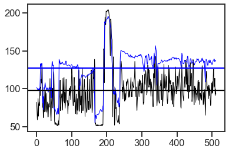
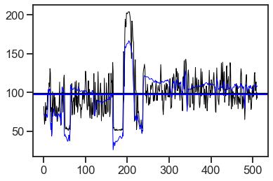
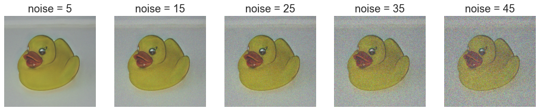
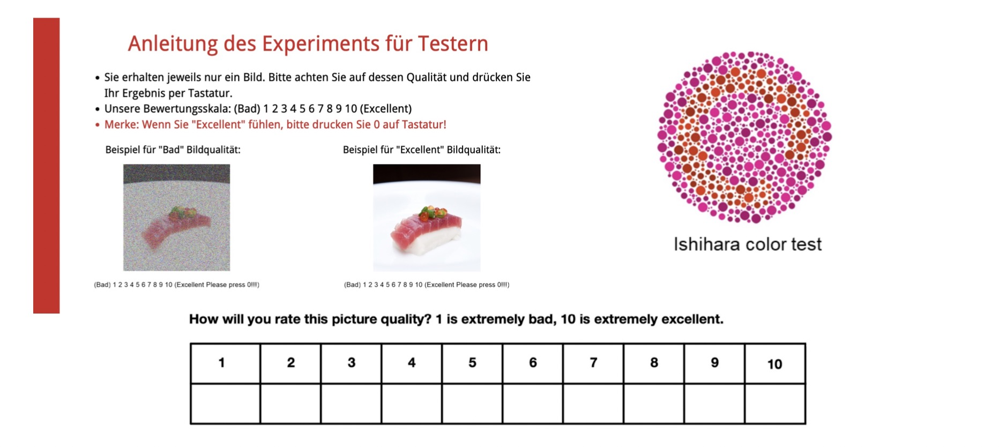
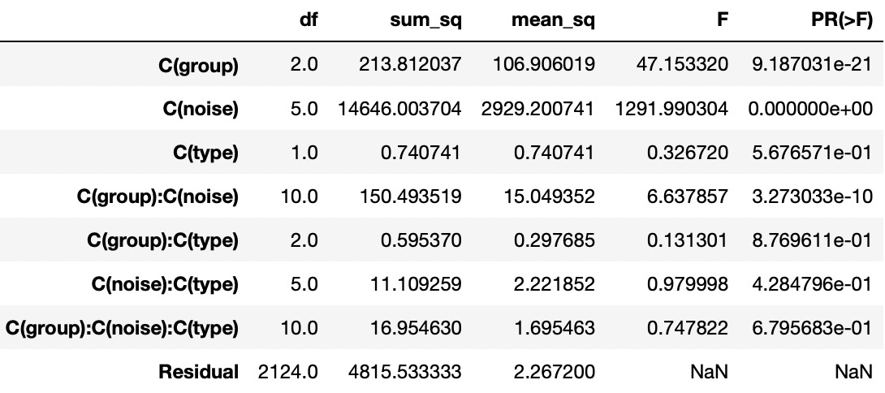
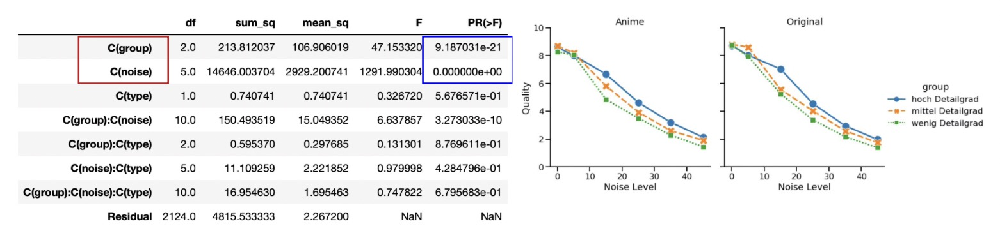
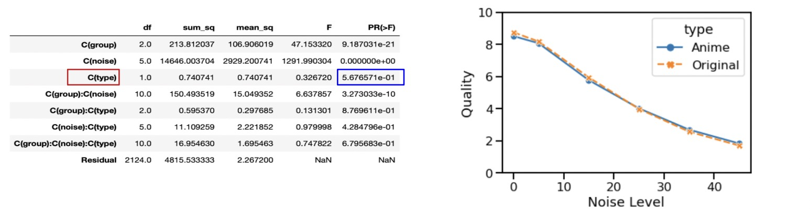

# Der Effekt der Anime-Konvertierung auf das Bild nach dem Hinzufügen von weißem Rauschen
## Xiaojie Sun, You Zou, Yian Yu
### Seminar: Visuelle Wahrnehmung beim Menschen und Bildqualität - WiSe 2020/21
### Geleitet von Prof. Dr. Marianne Maertens und Dr. Guillermo Aguilar


```python
from PIL import Image # Pillow image library
import numpy as np
import matplotlib.pyplot as plt
from scipy.interpolate import interp1d

import pandas as pd
import seaborn as sns
sns.set_style('ticks')
sns.set_context('talk')
```

## 1. Einleitung

AnimeGan, das 2021 veröffentlicht wurde, ist eine neue Möglichkeit, Fotos von echten Szenen in Anime-Stil umzuwandeln. Es erfüllt eine sinnvolle und herausfordernde Aufgabe in den Bereichen Computer Vision und künstlerischer Stiltransfer. Durch die Beobachtung der Anime-Konvertierung, merken wir, dass die Anime Bildern weniger für menschliche Wahrnehmung wichtige Details enthalten. Dafür haben wir folgenden Fragestellung erstellt:
Unterscheidet sich der Effekt von weißem Rauschen auf die wahrgenommene Bildqualität zwischen Originalbildern und Anime-Bildern?


## 1.1. Hypothese

Um den Detailgrad zu definieren, haben wir zwei Forschungslinien verfolgt: In eine Richtung, Detailgrad verringert sich durch Anime-Konvertierung. Darüber haben wir vermutet, Die Bewertung des Anime ist höher als das Originalbild unter dem gleichen Rauschen im Liniendiagramm jeder Gruppe. In ein andere Richtung, ein Bild kann weniger Details enthalten. Mit anderen Worten, jedes Bild hat einen anderen Detailgrad. Und wir denken, die Bewertung der Gruppe mit einem hohen Detailgrad bei gleichem Rauschlevel schlechter als eine Gruppe mit einem geringen Detailgrad ist. Weil je mehr Details die Originalbilder haben, desto mehr Details gehen bei der Konvertierung verloren, daraus folgt eine schlechter Bewertung.


## 2. Versuchsplan

### 2.1 Variablen und Versuchsbedingung
Für Unabhängige Variablen haben wir zunächst 5 Stufen weißes Rauschen mit den Stufen 5, 15, 25, 35, 45. Gefolgt von 3 Gruppen von Bildern: viele Einzelheiten (zum Beispiel Menschliches Gesicht), Fotos mit mittlerer Details (zum Beispiel Landschaft) und Fotos mit nur wenigen Details (Das Meer, einfache Grafik). Schließlich gibt es noch zwei Typen von Bildern, Original und Anime. Die abhängigen Variablen sind wahrgenommene Bildqualität.

Daher gibt es für jedes Bild 12 verschiedene Formen, nämlich 6 aus dem Originalbild und 6 aus dem Anime-Bild. Für jede Gruppe haben wir 10 Bilder, deshalb insgesant haben wir 360 durchgänge.

### 2.2 Vorbereitung
Um den Unterschied zwischen dem Originalbild und dem Anime-Bild nach AnimeGAN zu quantifizieren, haben wir den mittleren quadratischen Fehler (MSE) zwischen dem Originalbild und dem Anime-Bild berechnet.Die beiden folgenden Bilder haben beispielsweise einen MSE-Wert von 100,68:


```python
# reading image with PIL module
original = Image.open('orig1p9.png')
anime = Image.open('anig1p9.png')
# converting it to a numpy array. numpy arrays are easier to manipulate 
im_original = np.array(original)
im_anime = np.array(anime)

def mse(im1, im2):
    N = im_original.size 
    return (1.0/N)*np.sum((im1 - im2)**2)

plt.figure()
plt.subplot(1,2,1)
plt.axis('off')
plt.imshow(im_original)
plt.subplot(1,2,2)
plt.axis('off')
plt.imshow(im_anime)
print('MSE', mse(im_original, im_anime))
```

    MSE 100.682191212972
    


    

    


Wir möchten Unterschiede von Anime Konvertierung minimieren,wie z.B.die mittlere Helligkeit Verschiebung, deshalb verringern wir die Helligkeit der Anime-Bildern, damit wir einzige Variable haben, also die Anzahl von Einzelheiten.

Als nächstes haben wir den rgb-Dreikanal-Durchschnittswert in der mittleren Reihe des Originalbildes und des Anime-Bildes extrahiert und ihren Unterschied visualisiert：


```python
def show_2cuts(im1, im2):    
    m = int(im_original.shape[0]/2) # middle row

    rgb1 = im1[m, :]
    rgb2 = im2[m, :]
    cut1 = []
    cut2 = []
    for key in rgb1:
        i = np.mean(key)
        cut1.append(i)
    for key in rgb2:
        i = np.mean(key)
        cut2.append(i)
    mean1 = np.mean(cut1)
    mean2 = np.mean(cut2)
    plt.figure()
    plt.plot(cut1, c='k', linewidth=1)
    plt.plot(cut2, c='b', linewidth=1)
    plt.axhline(y=mean1,color="black")
    plt.axhline(y=mean2,color="blue")
    difference = mean1 - mean2
    print("Difference",difference)
    return difference
delta = show_2cuts(im_original, im_anime)
```

    Difference -28.828124999999986
    


    

    


Die Helligkeit des Anime-Bildes wird im folgenden Bildpaar reduziert, und die aktuelle Differenz ist ungefähr null:


```python
im_animex = im_anime+delta
im_animex = im_animex.astype('uint8')
plt.figure()
plt.subplot(1,2,1)
plt.axis('off')
plt.imshow(im_original)
plt.subplot(1,2,2)
plt.axis('off')
plt.imshow(im_animex)
newdelta = show_2cuts(im_original, im_animex)
print(newdelta)
```

    Difference 0.171875
    0.171875
    


    

    


    

    


Um die Auswirkung der Detailgrad auf die Qualität des verrauschten Bildes zu untersuchen, wir wählen Originalbilder mit unterschiedlichen Anzahl von Einzelheiten aus und wandeln sie in Animation um. Wir haben die Bilder je nach Detailgrad in drei Gruppen eingeteilt:

- Gruppe 1: Fotos mit vielen Details (Datei größer als 500 kb)
- Gruppe 2: Fotos mit mittleren Details (Datei zwischen 300 kb und 418 kb)
- Gruppe 3: Fotos mit nur wenigen Details (Datei kleiner als 187 kb)

Nach der Gruppenverteilung merken wir uns, dass die Bilder in einer Gruppe sind, sich in einem bestimmten Bereich von Dateigrößen liegen.


```python
import matplotlib.pyplot as plt
import numpy as np
import pandas as pd

# import dataset and convert it into a format that is convenient for drawing
Dataset = pd.read_csv('size.csv')
group = Dataset.groupby(['filesize','Difference']).agg('mean').reset_index()
group1 = Dataset['filesize']

# draw a one-dimensional scatter plot
def plot_one_dim(x, xLabel=None, yLabel=None, color=None):
    
    C = max(x) - min(x)
    fig = plt.figure(figsize=(20, 2))     
    N = len(x)
    # Assign a value of 0 to the Y coordinate
    y = np.zeros(N)    
    
    # draw scatter
    ax = fig.add_subplot(111, frameon=True, yticks=[])    
    ax.spines['top'].set_visible(False)
    ax.spines['right'].set_visible(False)
    ax.spines['left'].set_visible(False)    
    ax.scatter(x,y,c=color)
    ax.yaxis.set_ticks_position('left')
        
    # Display 0 of y coordinate as yLabel
    if yLabel is not None:
        plt.yticks([0],[yLabel])
    
    # Display xLabel
    if xLabel is not None:
        ax.set(xlabel=xLabel)
    
    # Set the y-axis range
    plt.ylim((-1, 1))   
    plt.title("To divide 3 Groups", loc='center', fontsize=15, fontweight=0)
    plt.show()

# set style
plt.style.use('seaborn-darkgrid')
plot_one_dim(group1.values, "filesize", "point","c")
```


    

    


Danach fügen wir jedem Original und Anime-Bild 5 bis 45 Rauschstufen hinzu:

Beispiel von Gruppe 3 (wenig Detailgrad): 


```python
original = Image.open('orig3p1.png')
anime = Image.open('anig3p1.png')
im_original = np.array(original)
im_anime = np.array(anime)

sigma = [5, 15, 25, 35, 45]

plt.figure(figsize=(16, 8))
for i, q in enumerate(sigma):
    noise = np.random.normal(loc=0, scale=q, size=im_original.shape)
    im_e1 = im_original + noise 
    im_e1 = im_e1.astype('uint8')
    plt.subplot(1,5,i+1)
    plt.imshow(im_e1)
    plt.axis('off')
    plt.title('noise = %d' % q)

plt.figure(figsize=(16, 8))
for i, q in enumerate(sigma):
    noise = np.random.normal(loc=0, scale=q, size=im_original.shape)
    im_e2 = im_anime + noise
    im_e2 = im_e2.astype('uint8')
    plt.subplot(1,5,i+1)
    plt.imshow(im_e2)
    plt.axis('off')
    plt.title('noise = %d' % q)
    

```


    

    


    

    


Beispiel von Gruppe 2 (mittel Detailgrad): 


Beispiel von Gruppe 1 (hoch Detailgrad):


Zu Beginn des Experiments erhalten die Teilnehmer eine Anleitung, die testpersonen wird ein Standard gezeigt.
Dies ermöglicht den testpersonen einen einheitlichen Maßstab bei der Beurteilung. Ishihara color test wird auch benutztm um farbenblinde Tester auszuschließen.

Jedes Bild wird alleine bewertet, und die Testreihenfolge der 360 Bilder sollte zufällig sein. Damit die Teilnehmer genauere Daten beschreiben können, wird 10-stufige MOS-Bewertungsskala benutzt.



## 3. Ergebnisse

Die folgende Abbildung zeigt die Wahrnehmungsskalen für unsere Stimuli und zwei Beobachter (der Autor und ein naiver Teilnehmer).

Für verschiedenen Bildtype weisen die Skalen der beiden Beobachtegruppen geringfügige Unterschiede auf. Und egal für welche Versuchspersonen ist festzustellen, dass die Bewertungen für Anime und Original sind bei jedem noise level sehr ähnlich, der Effekt der anive-Konvertierung auf die Rauschwirkung nicht einfach zu bemerken werden kann.

Für verschiedenen Bilddetailgrad weisen die Skalen der beiden Beobachtegruppe aber größere Unterschiede auf. Wir haben festgestellt, egal für experte Person oder naive Person, dass verschiedene Gruppen unterschiedlich bewertet werden. Die Bilder mit höhere Detailgrad besitzen auch bessere Bewertung. Damit wirkt die Detailsgrad im Bild sich selbst auf den Rauscheffekt aus.


```python
newdata = pd.read_csv('newdata.csv')


g = sns.relplot(x='noise', y='response', data=newdata, 
                hue='type',kind='line', ci = None, markers=True, 
                style='type', linewidth = 3, markersize=15)
g.set_ylabels('Quality')
g.set_xlabels('Noise level')
```


    <seaborn.axisgrid.FacetGrid at 0x26b67f36a30>


    

    


```python
g = sns.relplot(x='noise', y='response', data=newdata, hue='group',
                col='type',kind='line',ci=95,markers=True, err_style='bars',
                style='group', linewidth = 3, markersize=12, err_kws={'elinewidth':4})
g.set_ylabels('Quality')
g.set_xlabels('Noise Level')
g.set_titles('{col_name}')
g.set(ylim = (0, 10))
```


    <seaborn.axisgrid.FacetGrid at 0x26b67f5cb80>


    

    


## 4.Statistical analysis


```python
# for an ANOVA we need the python module statsmodels (statistical models)
import statsmodels.api as sm  

# the particular function we need is called ols()
# (ols: ordinary least squares, that is the type of fitting)
from statsmodels.formula.api import ols 

# we need to set up a 'formula' for the model. This formula is similar to the syntax in R.

# on the left side of the tilde we put the dependent variable
# on the right side of the tilde we state the independent variables 
# the C( )  indicates that we consider the variable as a categorical variable (and not continuous)
# the sign + is not a sum, it is to indicate more than one variable.
# the sign * is not a multiplication, it is to indicate we want to also model interactions between the variables

# we call ols() passing the model 'formula'
mod = ols('response ~ C(group) * C(noise) * C(type)',data=newdata)

# we fit the model
fit = mod.fit()

# we show the ANOVA table
sm.stats.anova_lm(fit)
```
Wir verwenden ANOVA, um zu analysieren, ob es einen signifikanten Unterschied zwischen allen Daten gibt.

Auf der linken Seite der Abbildung unten sehen wir drei Gruppen von unabhängigen Variablen, sie sind C(group), C(noise) und C(type). Die rechte Spalte zeigt den entsprechenden p-Wert. Ein p-Wert kleiner als 0,05 (bei 95 %) verwirft allgemeine Hypothese, Das bedeutet, es gibt doch einen Unterschied.

Wir können also sehen, dass es für die Variablen "group" und "noise" Unterschiede gibt, weil p-Wert<0,05, was auch dem Bild im dritten Absatz "Ergebnisse" entspricht. Für die Variable "type", p-Wert > 0,05, d. h. es gibt keinen Unterschied. Dies entspricht auch dem Bild im dritten Absatz „Ergebnisse“.



## 5. Interpretation

In Fragestellung stellen wir die Frage: Unterscheidet sich der Effekt von weißem Rauschen auf die übernommene Bildqualität zwischen Originalbildern und Animes dieser Bilder?

Basierend auf dieser Frage schlagen wir zwei weitere Hypothesen vor:

1. Die Bewertung der Gruppe mit einem hohen Detailgrad bei gleichem Rauschlevel ist schlechter als eine Gruppe mit einem einfachen Detailgrad.

2. Die Bewertung des Anime ist höher als das Originalbild unter dem gleichen Rauschen im Liniendiagramm jeder Gruppe.

Jetzt werden wir überprüfen, ob unsere Hypothese gilt.

Als wir das Experiment durchgeführt haben, haben wir auch festgestellt, dass das Bild mit weniger Details (Gruppe 3) einen schlechteren Effekt hat, nachdem weißes Rauschen hinzugefügt wurde. Dies ist genau das Gegenteil unserer ersten Hypothese. Die erste Annahme trifft also nicht zu.
Als Grund für dieses Phänomen, denken wir: Die Anzahl der im Originalbild enthaltenen Details spielt eine führende Rolle bei der menschlichen Wahrnehmung des Bildinhalts. Selbst wenn das Hinzufügen von Rauschen die Erkennung stört, beurteilen die Menschen die Bildqualität immer noch auf der Grundlage der erkannten Details, ohne eine schlechtere Wertung wegen größerem Detailverlust zu vergeben.



Vorher haben wir geahnt, Anime-Bilder weniger für menschliche Wahrnehmung wichtige Details enthalten, hat weißes Rauschen in Animes einen geringeren Einfluss auf die wahrgenommene Bildqualität als in den Originalbildern, aber aus den experimentellen Daten geht hervor, dass auch das falsch ist. Gemäß den Ergebnissen von ANOVA ist ersichtlich, dass die Anzahl der Details zwischen Anime und Ori keinen Einfluss auf das Hinzufügen von weißem Rauschen hat.



Daher können wir durch dieses Experiment ein Fazit ziehen: Die Menge an Detailinformationen, die im Bild selbst enthalten sind, hat einen Einfluss auf den Rauscheffekt. Aber weißes Rauschen wirkt sich jedoch nicht auf die Anzahl der Details zwischen Anime und origniale Bildern aus.

### Mögliche Probleme 

Wir sind während des Experiments auch auf viele Probleme gestoßen, darunter: Die Testperson berichtete, dass die Testzeit zu lang war. Oder noch einmal,
Der Tester wusste den Fortschritt des Experiments nicht und bestimmt sich mittendrin erschöpft.

Wir schlagen auch verbesserte Methoden vor, wie z. B. Fügen dem Testprogramm einen Fortschrittsbalken hinzu, oder
Fügen Sie der Testseite einen Timer hinzu.

### Referenzen
- https://huggingface.co/spaces/akhaliq/AnimeGANv2
- https://xerrors.fun/anime-gan-note/
- https://stefan.winkler.site/resources.html
- http://database.mmsp-kn.de/iqa-experts-300.html
- http://database.mmsp-kn.de/koniq-10k-database.html
- https://en.wikipedia.org/wiki/Ishihara_test